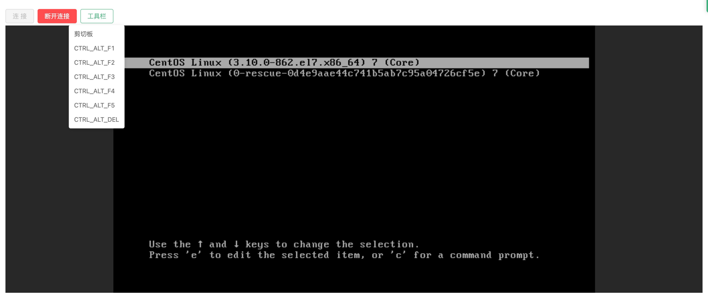

# **VNC Proxy Library for Go**
go-vnc-proxy is a VNC proxy library for Go

 - Supports multiple NOVNC WebSocket client connections 
 - Supports being a "websockify" proxy (for web clients like NoVnc)
 - Supports X509None(vencrypt)
 - Tested on tight encoding with:
   - NoVnc(web client) => use novnc.html to open a websocket
   
 _注: [中文文档](./README_zh.md)_
## **Usage:**
 
 ````shell script
  go get github.com/lwydyby/go-vnc-proxy
 ````
 ### code example
 ````go
 package main
 
 import (
 	"bytes"
 	"errors"
 	"fmt"
 	log "github.com/sirupsen/logrus"
 	"golang.org/x/net/websocket"
 	"gopkg.in/yaml.v2"
 	"io/ioutil"
 	"lwydyby/go-vnc-proxy/conf"
 	"lwydyby/go-vnc-proxy/proxy"
 	"net/http"
 	"os"
 	"path/filepath"
 	"runtime"
 	"runtime/debug"
 	"strconv"
 	"strings"
 	"time"
 )
 
 var logLevel uint32
 
 func init() {
 	filename, _ := filepath.Abs("./example/etc/app.yml")
 	yamlFile, err := ioutil.ReadFile(filename)
 	if err != nil {
 		panic(err)
 	}
 	var c conf.AppConf
 	err = yaml.Unmarshal(yamlFile, &c)
 	conf.SetAppConf(c)
 	if err != nil {
 		panic(err)
 	}
 	getLogLevel(conf.Conf.AppInfo.Level)
 	log.SetReportCaller(true)
 	log.SetFormatter(&LogFormatter{})
 }
 
 func main() {
 	http.HandleFunc("/ws", proxyHandler)
 	log.Info("vnc proxy start success ^ - ^  websocket port: " + strconv.Itoa(conf.Conf.AppInfo.Port))
 	if err := http.ListenAndServe(":"+strconv.Itoa(conf.Conf.AppInfo.Port), nil); err != nil {
 		fmt.Println(err)
 		os.Exit(1)
 	}
 
 }
 
 //日志自定义格式
 type LogFormatter struct{}
 
 //格式详情
 func (s *LogFormatter) Format(entry *log.Entry) ([]byte, error) {
 	timestamp := time.Now().Format("2006-01-02 15:04:05")
 	var file string
 	var line int
 	if entry.Caller != nil {
 		file = filepath.Base(entry.Caller.File)
 		line = entry.Caller.Line
 	}
 	level := strings.ToUpper(entry.Level.String())
 	msg := fmt.Sprintf("%-15s [%-3d] [%-5s]  %s:%d %s\n", timestamp, getGID(), level, file, line, entry.Message)
 	return []byte(msg), nil
 }
 
 // 获取当前协程id
 func getGID() uint64 {
 	b := make([]byte, 64)
 	b = b[:runtime.Stack(b, false)]
 	b = bytes.TrimPrefix(b, []byte("goroutine "))
 	b = b[:bytes.IndexByte(b, ' ')]
 	n, _ := strconv.ParseUint(string(b), 10, 64)
 	return n
 }
 
 func NewVNCProxy() *proxy.Proxy {
 	return proxy.New(&proxy.Config{
 		LogLevel: logLevel,
 		TokenHandler: func(r *http.Request) (addr string, err error) {
 			defer func() {
 				// 处理所有异常，防止panic导致程序关闭
 				if p := recover(); p != nil {
 					debug.PrintStack()
 				}
 			}()
 			//todo 获取服务地址的方法
 			addr = "127.0.0.1:5900"
 			return
 		},
 	})
 }
 
 func proxyHandler(w http.ResponseWriter, r *http.Request) {
 	vncProxy := NewVNCProxy()
 	h := websocket.Handler(vncProxy.ServeWS)
 	h.ServeHTTP(w, r)
 }
 
 func getQuery(r *http.Request, key string) (string, error) {
 	keys, ok := r.URL.Query()[key]
 	if !ok || len(keys[0]) < 1 {
 		return "", errors.New("Url Param 'token' is missing ")
 	}
 	return keys[0], nil
 }
 
 func getLogLevel(level string) {
 	switch level {
 	case "info":
 		log.SetLevel(log.InfoLevel)
 	case "debug":
 		log.SetLevel(log.DebugLevel)
 	default:
 		log.SetLevel(log.DebugLevel)
 	}
 }


 ````

## WEB

The configuration needs to be modified

```
    VNC:"localhost:8080"  //vnc proxy url
```

